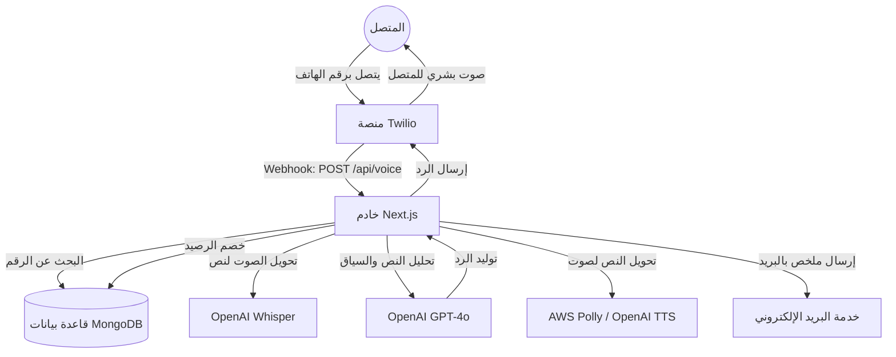

# مخطط المشروع - مساعد الاستقبال الذكي butTel

يوفر هذا المستند نظرة شاملة على بنية نظام **butTel**، وسير العمليات، ودليل الربط التقني.

## 1. مخطط هيكلية النظام (Architecture)

---

## 2. عملية التسجيل خطوة بخطوة

### المرحلة الأولى: إنشاء الحساب
1. **التسجيل (Sign Up):** يتوجه صاحب العمل إلى صفحة `/register` ويقوم بإدخال اسم الشركة، البريد الإلكتروني، وكلمة المرور.
2. **إعدادات الذكاء الاصطناعي:** أثناء التسجيل، يتم اختيار اللغات التي يجب أن يدعمها البوت (العربية، الألمانية، الإنجليزية).
3. **التحقق (Verification):** يقوم النظام بإرسال رمز تحقق (OTP) مكون من 6 أرقام إلى البريد الإلكتروني المسجل.
4. **التفعيل:** يقوم المستخدم بإدخال الرمز في صفحة التحقق لتفعيل الحساب والوصول إلى لوحة التحكم.

### المرحلة الثانية: إعداد ملف الشركة
1. **الدخول للوحة التحكم:** بعد التفعيل، يسجل المستخدم دخوله.
2. **تفاصيل العمل:** يضيف المستخدم عنوان الشركة، الخدمات المقدمة، وتعليمات خاصة للمساعد الذكي (مثلاً: "كن رسمياً جداً"، "الأولوية لحالات الطوارئ").
3. **ربط الهاتف:** يتم تحديد رقم الهاتف المخصص للشركة (الذي تم شراؤه من Twilio).

---

## 3. آلية الدفع ونظام الرصيد

يعمل النظام بنظام **الرصيد المسبق (Credits)**، حيث تستهلك كل مكالمة أو تفاعل قدراً من الرصيد.

1. **بدء الشحن:** يتوجه المستخدم إلى قسم "شحن الرصيد" (Recharge) في لوحة التحكم.
2. **اختيار الباقة:** يختار المستخدم عدد الدقائق المطلوبة (مثلاً 50 دقيقة، 100 دقيقة).
3. **بوابة الدفع:**
   - **Stripe:** للدفع عن طريق البطاقات الائتمانية.
   - **PayPal:** للدفع عبر المحفظة الإلكترونية.
4. **إضافة الرصيد:** عند نجاح العملية، يتم تحديث حقل `credits` في قاعدة البيانات تلقائياً.
5. **الاستهلاك:** عند استقبال مكالمة، يتحقق النظام من وجود رصيد. إذا كان الرصيد > 0، يستمر البوت في العمل ويخصم رصيد مقابل كل تفاعل.
6. **تنبيه انخفاض الرصيد:** عندما يصل الرصيد إلى حد معين (مثلاً دقيقة واحدة)، يرسل النظام بريداً إلكترونياً عاجلاً لصاحب الشركة لطلب إعادة الشحن.

---

## 4. كيفية ربط هاتف الشركة بالموقع (ليعمل البوت)

لربط رقم هاتف (حقيقي أو افتراضي) بمساعد الذكاء الاصطناعي، اتبع الخطوات التالية:

### الخطوة 1: الحصول على رقم من Twilio
- قم بتسجيل الدخول إلى [Twilio Console](https://www.twilio.com/console).
- قم بشراء رقم هاتف يدعم خاصية الصوت (Voice).

### الخطوة 2: ضبط الـ Webhook
- اذهب إلى **Phone Numbers > Active Numbers > [رقمك]**.
- ابحث عن قسم **Voice & Fax**.
- عند خيار **"A CALL COMES IN"**، اختر **Webhook**.
- ضع الرابط التالي: `https://your-app-domain.com/api/voice`
- اجعل الطريقة (Method) هي **HTTP POST**.
- اضغط حفظ (Save).

### الخطوة 3: مطابقة الرقم في لوحة تحكم butTel
- في لوحة تحكم **butTel**، تأكد من إضافة رقم الهاتف في ملف الشركة بنفس الصيغة الدولية (مثلاً: `+49123456789`).
- النظام يستخدم هذا الرقم ليتعرف على "هوية الشركة" التي تلقت الاتصال ليقوم بتحميل إعداداتها الخاصة والرد بناءً على سياقها.

### الخطوة 4: التجربة الحية
- قم بالاتصال بالرقم من هاتفك الشخصي.
- سيقوم Twilio بإرسال إشارة للموقع، وسيقوم الموقع بالرد عبر الذكاء الاصطناعي فوراً باللغة المناسبة.

---

## 5. ملخص المميزات
- **دعم لغات متعددة:** اكتشاف تلقائي للعربية والألمانية والإنجليزية.
- **توجيه ذكي:** فهم غرض المتصل (حجز موعد، استفسار، تحويل لموظف).
- **تقارير فورية:** إرسال ملخص المكالمة للبريد الإلكتروني للشركة فور انتهائها.
- **جاهزية 24/7:** الرد على المكالمات في أي وقت بناءً على منطق ساعات العمل المحدد.

### الخطوة النهائية (مهمة جداً):
لكي يعمل نظام التحديث التلقائي، يجب عليك القيام بـ خطوة واحدة أخيرة داخل حساب تويليو الخاص بك:

اذهب إلى حسابك في Twilio Console.
توجه إلى قسم Phone Numbers ثم Regulatory Compliance.
ابحث عن خيار Status Callback URL.
ضع هذا الرابط هناك: https://your-domain.com/api/webhooks/twilio-compliance (مع استبدال your-domain.com برابط موقعك الحقيقي).
بهذا الشكل، أصبحت دورتك البرمجية والقانونية في ألمانيا مؤتمتة بالكامل: العميل يرفع المستندات -> تويليو يراجع -> النظام يخطرك بالنتيجة ويحدث الحالة -> يمكنك شراء الرقم فور

---

### لوصل الواتس أب برقم العميل في موقعك باستخدام Kaleyra، تتم العملية في 3 خطوات بسيطة:

1. الإعداد التقني (مرة واحدة)
أضف مفاتيح Kaleyra (API KEY و SID) في ملف الـ .env الخاص بموقعك ليتمكن النظام من الاتصال بخدماتهم.

2. شراء الرقم وربط الشركة
من لوحة تحكم المسؤول (Admin Dashboard)، اختر الشركة المطلوبة.
قم بتغيير "المزود" (Provider) إلى Kaleyra.
أبحث عن رقم يدعم واتس أب واشترِه. سيقوم الموقع آلياً بربط هذا الرقم بمعرف الشركة في قاعدة البيانات.
3. تفعيل الرد الآلي (الربط البرمجي)
في لوحة تحكم Kaleyra، ضع رابط الـ Webhook الخاص بموقعك: https://your-domain.com/api/webhooks/kaleyra/whatsapp
الآن: أي رسالة تصل لهذا الرقم، يرسلها Kaleyra لموقعك -> موقعك يبحث عن الشركة صاحبة الرقم -> الذكاء الاصطناعي يحلل الرسالة ويرسل الرد فوراً للعميل.
الخلاصة: الربط يتم عن طريق رقم الهاتف؛ فموقعك يستخدم الرقم المستقبل للرسالة ليعرف لأي شركة ينتمي هذا الاستفسار ويجيب بناءً على بياناتها الخاصة.

---

### تعمل CEQUENS في موقعك كمزود خدمة اتصالات متخصص في منطقة الشرق الأوسط وشمال أفريقيا (MENA)، وخصوصاً في مصر والمملكة العربية السعودية والإمارات. إليك كيفية عملها باختصار:

1. التخصص الجغرافي
تم دمج CEQUENS في مشروعك لتوفير أرقام محلية في الدول العربية التي قد يكون من الصعب توفير أرقامها عبر تويليو بمرونة عالية، مما يضمن جودة اتصال أفضل وتكلفة أقل داخل المنطقة العربية.

2. آلية العمل التقنية
يعمل نظام CEQUENS عبر 
CequensAdapter
 كالتالي:

البحث عن الأرقام: يتصل بـ API الخاص بـ CEQUENS للبحث عن أرقام (مثلاً أرقام تبدأ بـ +20 لمصر أو +966 للسعودية).
الشراء والدفع: عند اختيار رقم، يتم إرسال طلب شراء لـ API الخاص بهم باستخدام CEQUENS_API_KEY.
التفعيل: يتم ربط الرقم فوراً بـ "الاستقبال الذكي" الخاص بالشركة في موقعك، حيث يتم توجيه المكالمات الصوتية الواردة لمعالجة الذكاء الاصطناعي.
3. نمط التجربة (Mock Mode)
في حال كنت في مرحلة التطوير ولم تضف مفتاح API حقيقي بعد، يقوم النظام محاكياً (Mock Mode) بتوليد أرقام عربية وهمية لتجربة واجهة المستخدم والتأكد من أن تدفق البيانات (Workflow) يعمل بشكل صحيح.

4. الربط في لوحة التحكم
المسؤول عن الموقع (Admin) يمكنه ببساطة:

الدخول لبيانات الشركة.
اختيار CEQUENS كمزود (Provider).
شراء رقم محلي عربي ليتم تفعيل الخدمة فوراً لتلك الشركة.
باختصار: CEQUENS هي "البوابة العربية" في تطبيقك، وهي المسؤولة عن توفير أرقام الهواتف والخدمات الصوتية المحلية للعملاء في الشرق الأوسط مع دعم كامل للذكاء الاصطناعي.

هل تود أن أقوم بتعديل واجهة لوحة تحكم الأدمن لتسهيل تصفية (Filtering) الأرقام العربية المتاحة عبر CEQUENS؟

Good

---

### تعمل Infobip في موقعك كمزود عالمي (Omnichannel) واسع النطاق، وهي الخيار الأفضل لتغطية الدول التي قد لا تتوفر أرقامها بسهولة لدى المزودين الآخرين، بالإضافة إلى قوتها الكبيرة في الرسائل النصية القصيرة (SMS). إليك التفاصيل باختصار:

1. الحل الشامل (Global Coverage)
تم دمج Infobip لتغطية احتياجات عملائك في أوروبا (مثل ألمانيا وتركيا) وشرق أوروبا، حيث تمتلك Infobip شبكة علاقات مباشرة مع مشغلي الاتصالات هناك، مما يضمن وصولاً أسرع وموثوقية عالية.

2. الآلية التقنية (
InfobipAdapter
)
يعمل النظام مع Infobip عبر الملف الآتي:

الاتصال بالـ API: يستخدم النظام INFOBIP_API_KEY ورابط الـ BASE_URL المخصص لحسابك (الذي تقدمه Infobip لكل عميل بشكل منفصل).
البحث والشراء: يتيح لك البحث عن أرقام افتراضية في دول مختلفة، وعند الشراء يتم ربط الرقم آلياً بالذكاء الاصطناعي في موقعك لمعالجة المكالمات.
التوثيق: يتميز نظام Infobip بتقديم تفاصيل دقيقة حول حالة الرقم والمنطقة التابع لها.
3. نمط التجربة (Mock Mode)
في حال اختيار Infobip دون وجود إعدادات حقيقية، سيقوم النظام بمحاكاة أرقام من دول مثل تركيا (+90) أو ألمانيا (+49)، مما يسمح لك باختبار تدفق العمل في تلك المناطق الجغرافية برمجياً.

4. القيمة المضافة في مشروعك
عند اختيار Infobip لشركة معينة:

يحصل العميل على رقم يتميز بجودة صوت عالية جداً.
يكون النظام جاهزاً للتوسع مستقبلاً ليشمل رسائل الـ SMS التنبيهية (مثل تأكيدات المواعيد) نظراً لأن Infobip هي الرائدة عالمياً في هذا المجال.
باختصار: Infobip هي "المزود العالمي" في تطبيقك، وهي تمنح مشروعك القدرة على العمل في أي مكان في العالم بموثوقية الشركات الكبرى.

هل تود أن أقوم بإضافة ميزة إرسال رسائل SMS تأكيدية للمواعيد عبر Infobip؟

---