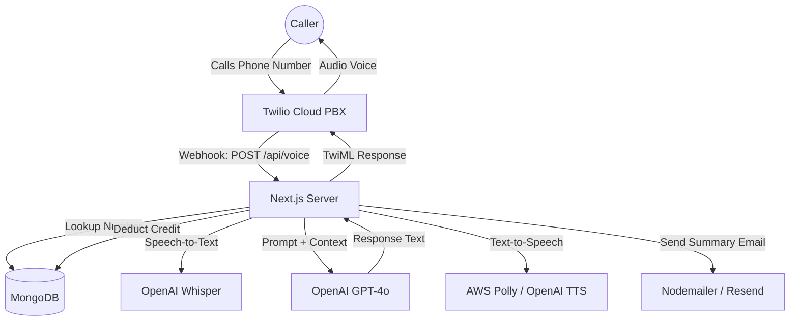

# business Blueprint - butTel AI Virtual Receptionist

This document provides a comprehensive overview of the **butTel** system architecture, operational workflows, and integration guides.

## 1. System Architecture Diagram

---

## 2. Step-by-Step Registration Process

### Phase 1: Account Creation
1. **Sign Up:** The business owner visits the `/register` page and provides the business name, email, and password.
2. **AI Configuration:** During registration, the user selects the primary languages the AI should support (Arabic, German, English).
3. **Verification:** The system generates a 6-digit OTP code and sends it to the registered email.
4. **Activation:** The user enters the code on the verification page to activate the account.

### Phase 2: Company Profile Setup
1. **Dashboard Access:** Once verified, the user logs into the dashboard.
2. **Business Details:** The user adds their address, services offered, and specific instructions for the AI (e.g., "Be very formal," "Priority to medical emergencies").
3. **Phone Integration:** The user specifies the phone number assigned to their business (purchased from Twilio).

---

## 3. Payment & Credits Workflow

The system operates on a **Credit-Based Model** where each interaction or minute of conversation consumes credits.

1. **Recharge Initiation:** The user navigates to the "Recharge" section in their dashboard.
2. **Select Package:** The user chooses a credit bundle (e.g., 50 minutes, 100 minutes).
3. **Payment Gateway:**
   - **Stripe:** For credit card payments.
   - **PayPal:** For digital wallet payments.
4. **Credit Allocation:** Upon successful payment, the `credits` field in the database is automatically incremented.
5. **Consumption:** When a call is processed, the system checks the balance. If credits > 0, it proceeds and deducts 1 credit per interaction.
6. **Low Balance Alert:** When credits fall below a threshold (e.g., 1 credit), the system sends an urgent email notification to the business owner to recharge.

---

## 4. Phone Linking Guide (Connecting to the Bot)

To connect a physical or virtual phone number to the AI bot, follow these steps:

### Step 1: Secure a Twilio Number
- Log in to the [Twilio Console](https://www.twilio.com/console).
- Purchase a phone number with Voice capabilities.

### Step 2: Configure the Webhook
- Navigate to **Phone Numbers > Active Numbers > [Your Number]**.
- Scroll down to the **Voice & Fax** section.
- Under **"A CALL COMES IN"**, select **Webhook**.
- Set the URL to: `https://your-app-domain.com/api/voice`
- Set the Method to **HTTP POST**.
- Save the configuration.

### Step 3: Match the Number in butTel
- In the **butTel Admin Panel**, ensure the company's "Phone Number" field exactly matches the Twilio number (in E.164 format, e.g., `+49123456789`).
- The system uses this number to identify which company's settings and AI profile to load when a call arrives.

### Step 4: Live Testing
- Call the Twilio number.
- Twilio will trigger the webhook, the server will recognize the company, and the AI receptionist will answer immediately in the configured language.

---

## 5. Summary of Features
- **Multilingual Support:** Auto-detection of Arabic, German, and English.
- **Smart Routing:** Identifies caller intent (Booking, Inquiry, Transfer).
- **Email Notifications:** Instant summaries sent to the business after every call.
- **24/7 Availability:** Handles calls even outside office hours based on custom logic.
